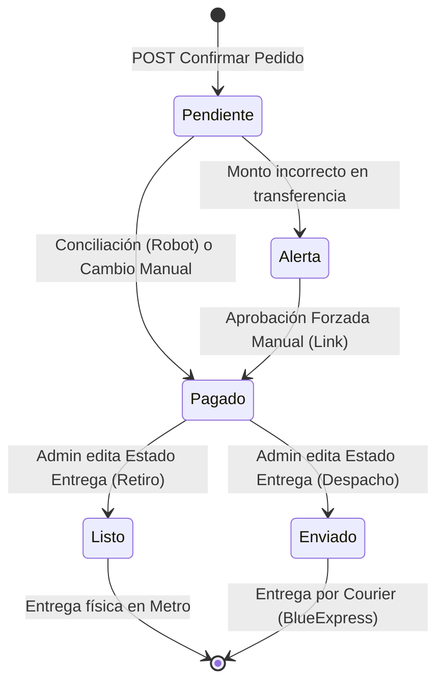
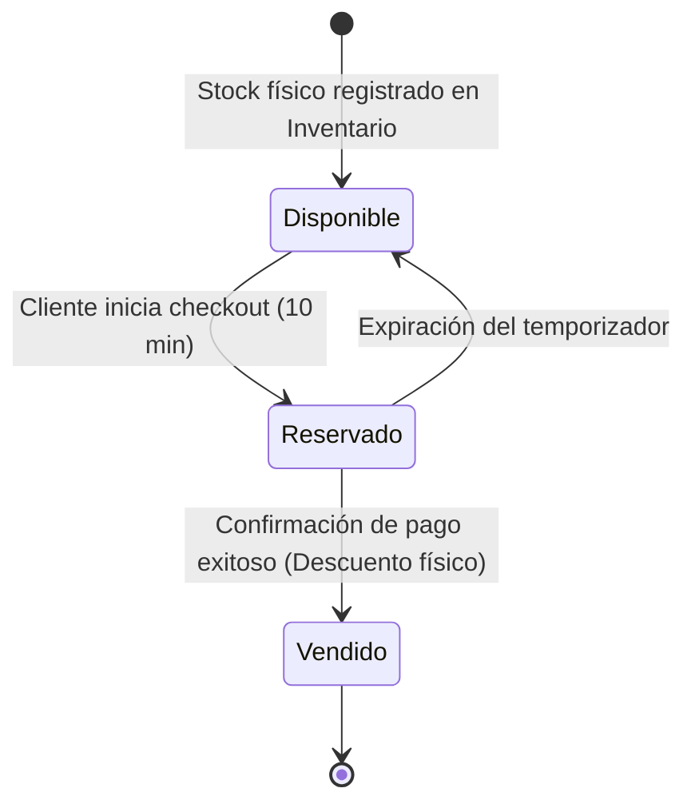
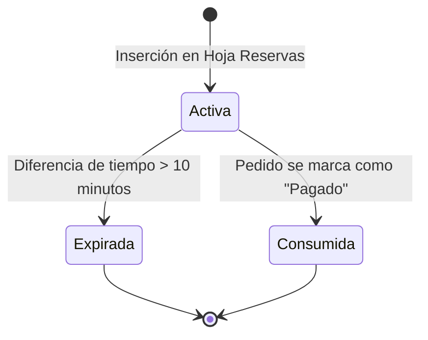

# 08. Máquinas de Estado (State Machines)

Este documento modela los diferentes estados y transiciones por los que pasan las entidades principales de **Arvinea Organic** a lo largo del flujo de compra y entrega.

---

## 1. Ciclo de Vida del Pedido (Order State Machine)

Un pedido transiciona a través de estados que determinan las alertas enviadas al dueño y los correos que recibe el comprador.

### Eventos y Transiciones
*   **POST Confirmar Pedido:** El usuario concreta la orden en la web. El pedido se graba en Sheets en estado `"Pendiente"`.
*   **Conciliación (Robot) o Cambio Manual:** El robot valida el monto en el inbox de Gmail, o el administrador escribe `"Pagado"` en el Sheets. El estado cambia a `"Pagado"`.
*   **Monto incorrecto en transferencia:** El robot detecta un depósito con ID correcto pero con diferencia de dinero. El estado cambia a `"Alerta"`.
*   **Aprobación Forzada:** El administrador valida el desfase de saldo y hace clic en el enlace `?action=aprobar` del correo, forzando la transición a `"Pagado"`.
*   **Despacho / Retiro:** Según la columna `Entrega` de la Hoja de Ruta, al marcar `"Enviado"` (Delivery) o `"Listo"` (Retiro), se gatillan correos con tracking o con botón de contacto de WhatsApp respectivamente.

---

## 2. Ciclo de Vida del Stock Físico (Stock State Machine)

Representa las fases de afectación de stock en el inventario real.

### Reglas Asociadas
*   **Disponible:** Corresponde a la cantidad registrada en Sheets. El cliente ve en la web `Stock Físico - Reservas Activas de 10 min - Stock de Seguridad (1)`.
*   **Reservado:** Bloqueo temporal en caliente en la hoja `Reservas`. Dura exactamente 10 minutos desde el timestamp de inserción.
*   **Vendido:** Transición física destructiva. Resta unidades reales de la celda de stock en la hoja `Inventario`.

---

## 3. Estado de la Reserva (Reservation State Machine)

Determina el ciclo de vida de los bloqueos de stock temporales.

