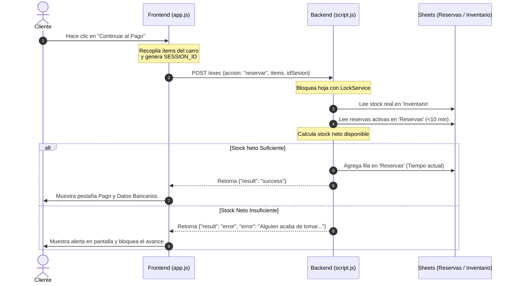
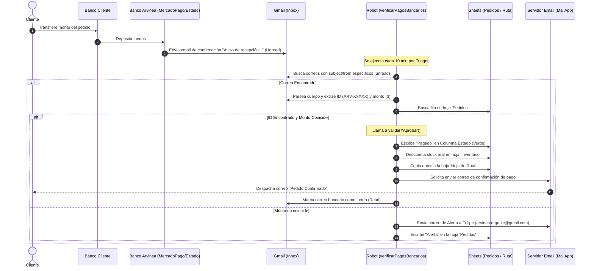
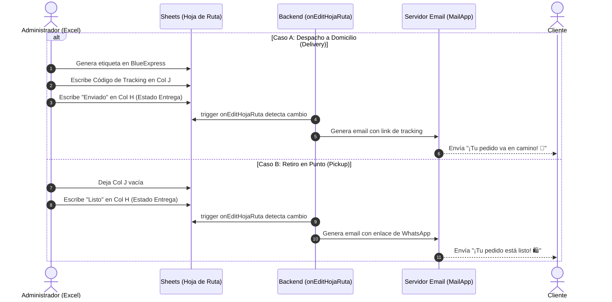

# 09. Diagramas de Secuencia (Sequence Diagrams)

Este documento describe paso a paso la comunicación y el intercambio de mensajes entre el Cliente, el Frontend, el Backend en Google Apps Script, y la Base de Datos (Google Sheets).

---

## 1. Flujo de Reserva Temporal de Stock (Anti-Secuestro)

Este proceso ocurre cuando el cliente hace clic en el botón de pagar e ingresa los datos personales del sidebar.

---

## 2. Flujo de Compra y Conciliación Bancaria Automática (Robot)

Representa el proceso asíncrono desde que el cliente transfiere en su banco hasta que el robot multibanco valida el pago.

---

## 3. Flujo de Logística y Aviso de Despacho (Manual Admin)

Describe la interacción al momento de realizar el empaque físico y despacho por courier o entrega presencial.

